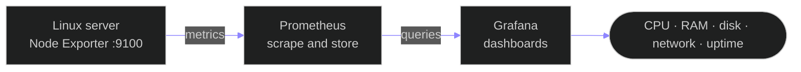

<div align="center">


<a href="https://github.com/rafan-coder">
  
</a>

<br/>

<a href="https://venerable-belekoy-289a67.netlify.app"></a>
<a href="https://www.linkedin.com/in/rafan-rahuf-ab450636b"></a>
<a href="mailto:rafanrahuf@gmail.com"></a>
<a href="https://github.com/rafan-coder"></a>

<br/><br/>


<br/><br/>


</div>


## About me

<table>
<tr>
<td width="62%" valign="top">

I'm a recent **B.Tech graduate in Artificial Intelligence & Machine Learning** with a strong foundation in **IT infrastructure, cloud computing, networking and Linux**. I learn by building: Linux servers, monitoring stacks and CI/CD pipelines. I'm looking for a **Junior IT Infrastructure Engineer** role to support reliable systems, system administration and cloud operations.

| | |
|---|---|
| **Name** | Rafan A |
| **Role** | Junior IT Infrastructure Engineer |
| **Location** | Dubai, UAE 🇦🇪 |
| **Education** | B.Tech AI & ML (2022 – 2026) |
| **Cloud** | AWS · Azure · Google Cloud |
| **Languages** | English · Tamil · Arabic · Hindi |
| **Availability** | Immediately |

</td>
<td width="38%" align="center" valign="middle">


<br/><br/>


</td>
</tr>
</table>


## Live from my server

<div align="center">



</div>

```console
rafan@ubuntu-server:~$ ./health-check.sh
[ ok ]  hostname ........ ubuntu-server
[ ok ]  cpu load ........ 0.42 0.38 0.35
[ ok ]  memory .......... 3.1G of 8.0G used (39%)
[ ok ]  disk / .......... 41% used
[ ok ]  network ......... 8.8.8.8 reachable, 12 ms
[ ok ]  services ........ ssh, cron, systemd-resolved active
[ ok ]  backup .......... archive written
rafan@ubuntu-server:~$ _
```

<sub>Illustrative output of the kind of report my Bash health-check script produces.</sub>


## Tech stack

<div align="center">

**Operating systems and scripting**<br/>
<br/><br/>

**Cloud and DevOps**<br/>
<br/><br/>

**Monitoring and tools**<br/>


</div>

<details>
<summary><b>Full skill breakdown (click to expand)</b></summary>

<br/>

| Area | Skills |
|---|---|
| **IT operations** | Troubleshooting, Monitoring, Incident Management, Ticket Resolution, RCA, Server Administration |
| **Microsoft infrastructure** | Active Directory, Microsoft Entra ID, PowerShell, Intune Fundamentals |
| **Networking** | TCP/IP, DNS, DHCP, Subnetting, Routing, VPN, Firewalls, Ping, Tracert, Nslookup, Ipconfig |
| **Cloud concepts** | Virtual Machines, Cloud Storage, Virtual Networks, IAM, Scalability, Availability, Security Fundamentals |
| **DevOps and monitoring** | Git, GitHub Actions, Docker, CI/CD, Prometheus, Grafana, Node Exporter |
| **Scripting and databases** | Bash, Python, SQL, HTML, CSS |

</details>


## Featured projects

<div align="center">

<table>
<tr>
<td width="33%" valign="top" align="center">

### 🐧 Linux Server Administration & Automation
<sub>Managed users, groups, permissions, processes and services on Ubuntu. Wrote Bash scripts for system info, health checks and automated backups.</sub>

<br/><br/>


<br/><br/>

<a href="https://github.com/rafan-coder?tab=repositories"></a>

</td>
<td width="33%" valign="top" align="center">

### 📈 Grafana & Prometheus Monitoring
<sub>Configured Prometheus and Node Exporter to collect Linux metrics. Built a Grafana dashboard tracking CPU, RAM, disk, network traffic and uptime.</sub>

<br/><br/>


<br/><br/>

<a href="https://github.com/rafan-coder?tab=repositories"></a>

</td>
<td width="33%" valign="top" align="center">

### ⚙️ CI/CD with GitHub Actions & Docker
<sub>Built a Python app with Pytest tests, containerized it with Docker, and automated test runs on every code change using GitHub Actions.</sub>

<br/><br/>


<br/><br/>

<a href="https://github.com/rafan-coder?tab=repositories"></a>

</td>
</tr>
</table>

<a href="https://github.com/rafan-coder?tab=repositories"></a>

</div>

<br/>

### How my monitoring stack works



### How my CI/CD pipeline works

<div align="center">



</div>


## Highlights

<div align="center">


<br/>


</div>


## GitHub analytics

<div align="center">


<br/>


</div>


## Currently focused on

- ☁️ Deepening hands-on experience with **AWS, Azure and GCP**
- 🐧 Building stronger **Linux server administration** and automation skills
- 📈 Expanding **monitoring and observability** setups
- 🪟 Working with **Active Directory, Entra ID and PowerShell**
- 💼 Looking for a **Junior IT Infrastructure Engineer** role in the UAE


## Let's connect

<div align="center">

I'm available immediately and happy to talk about infrastructure, cloud and monitoring roles.

<br/>

<a href="https://venerable-belekoy-289a67.netlify.app"></a>
<a href="mailto:rafanrahuf@gmail.com"></a>
<a href="https://www.linkedin.com/in/rafan-rahuf-ab450636b"></a>

<br/><br/>


</div>


<div align="center">
  <sub>Thanks for visiting my profile.</sub>
</div>
